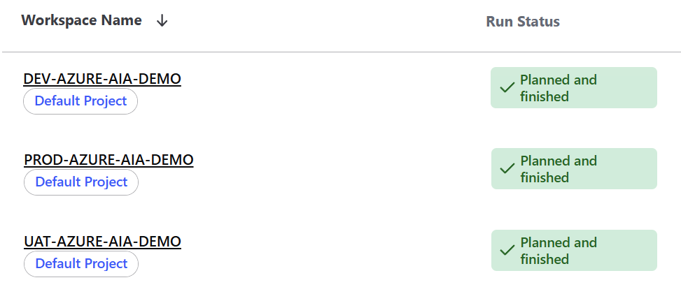
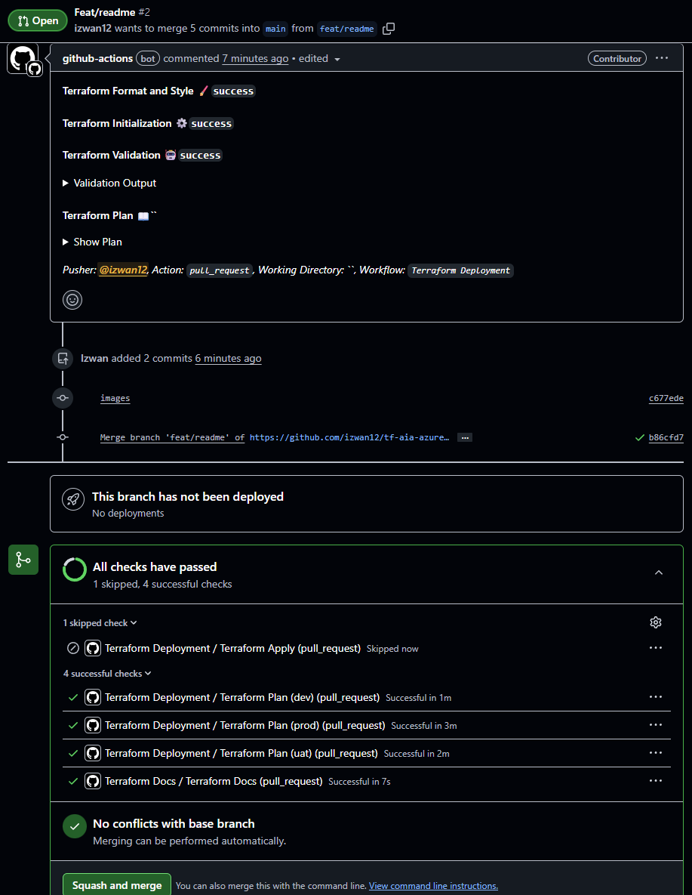
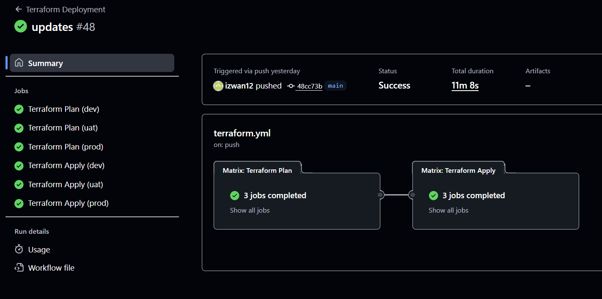
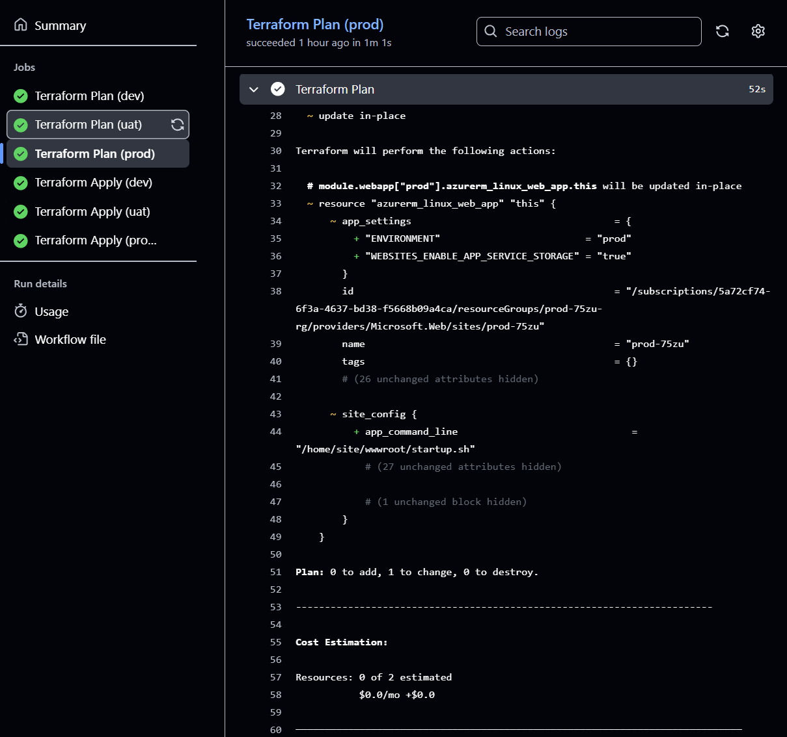
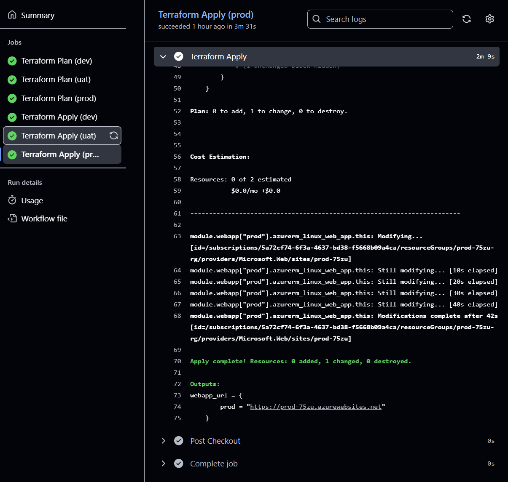
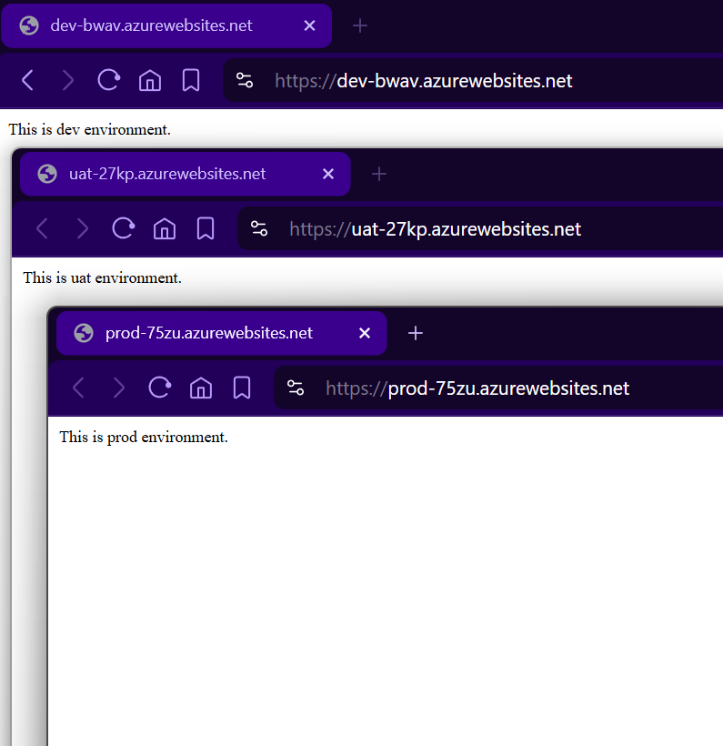

# Terraform - Azure Web App Deployment

This repository contains Terraform code to deploy an Azure Web App (Linux) using a Docker image, with GitHub Actions automating deployments for each environment.

## Overview

The Terraform configuration provisions:

- Resource Group
- App Service Plan
- Linux Web App

Each deployment is parameterized by environment (dev, uat, prod) through Terraform environment folder and GitHub Actions matrix.

## Automated Terraform Deployment via GitHub Actions

GitHub Action automatically handles:

- Terraform initialization for each environment to separate workspaces.
- Deploys to separate workspaces based on environment (dev, uat, prod).

- `Terraform Plan` runs on every PR and auto comments the PR with result.

- `Terraform Apply` runs only on merge to `main`.
- Approval required for PROD.

## How to Deploy

1. Create a new feature branch.
2. Update `terraform.tfvars` in required environment folder (dev, uat,prod).

```yaml
webapp_vars = [
  {
    env          = "dev"
    location     = "Canada Central"
    sku_name     = "B1"
    os_type      = "Linux"
    docker_image = "httpd:latest"
  }
]
```

1. Make a new pull request.
2. `Terraform Deployment` action will run automatically to trigger `Terraform Plan`. (Apply is skipped for PR)
3. If plan is successful, proceed to merge.
4. On merge, `Terraform Deployment` action will run automatically to trigger `Terraform Apply` and deploy resources to respective environment.

## Terraform Module Structure

- Module stored in `/modules/webapp/` contains:
  - azurerm_resource_group
  - azurerm_service_plan
  - azurerm_linux_web_app
  
- Variables required:
  - env
  - location
  - name_prefix
  - docker_image
  - docker_registry
  - sku_name
  - os_type

- Root `main.tf` references the module

```yaml
module "webapp" {
  for_each = { for webapp in var.webapp_vars : webapp.env => webapp }

  source       = "./modules/webapp"
  name_prefix  = local.name_prefix
  env          = each.value.env
  location     = each.value.location
  sku_name     = each.value.sku_name
  os_type      = each.value.os_type
  docker_image = each.value.docker_image
}
```

- `terraform.tfvars` in each `/environments/<env>/` folder determines the configuration for each environment infrastructure

```yaml
webapp_vars = [
  {
    env          = "dev"
    location     = "Canada Central"
    sku_name     = "B1"
    os_type      = "Linux"
    docker_image = "httpd:latest"
  }
]
```

## Demo Results:









# Terraform Docs

<!-- BEGIN_TF_DOCS -->
## Requirements

| Name | Version |
|------|---------|
| <a name="requirement_azurerm"></a> [azurerm](#requirement\_azurerm) | >= 4.0 |

## Providers

| Name | Version |
|------|---------|
| <a name="provider_random"></a> [random](#provider\_random) | n/a |

## Modules

| Name | Source | Version |
|------|--------|---------|
| <a name="module_webapp"></a> [webapp](#module\_webapp) | ./modules/webapp | n/a |

## Resources

| Name | Type |
|------|------|
| [random_string.suffix](https://registry.terraform.io/providers/hashicorp/random/latest/docs/resources/string) | resource |

## Inputs

| Name | Description | Type | Default | Required |
|------|-------------|------|---------|:--------:|
| <a name="input_webapp_vars"></a> [webapp\_vars](#input\_webapp\_vars) | List of webapp variables | <pre>list(object({<br/>    env          = string<br/>    location     = string<br/>    sku_name     = string<br/>    docker_image = string<br/>    os_type      = string<br/>  }))</pre> | n/a | yes |

## Outputs

| Name | Description |
|------|-------------|
| <a name="output_webapp_url"></a> [webapp\_url](#output\_webapp\_url) | URL of the web app |
<!-- END_TF_DOCS -->